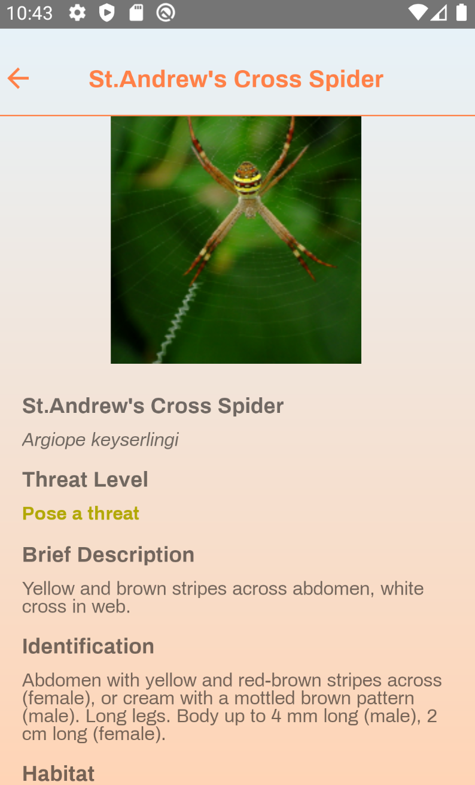
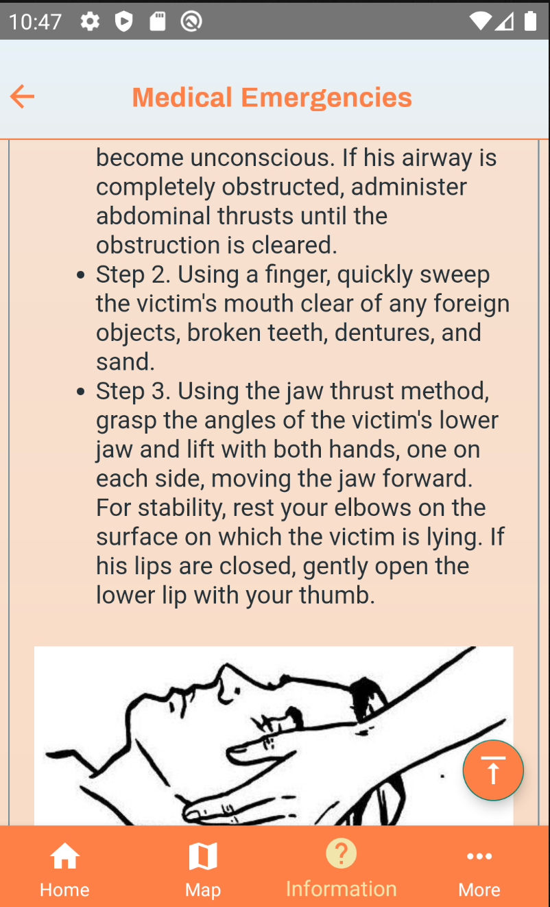

# WildSecured - Android App
Monash IE FIT5120

Full App Demo:[Youtube](https://youtu.be/v4Tu2H-buG0?si=nPrM5jFWTo2G4-F0)

## About

Victoria Hiker's Companion: An Android app dedicated to aiding hikers and campers in Victoria, Australia. Packed with trail data, campsite info, weather forecasts, and planning tools, this app ensures a safe and well-prepared adventure in Victoria's diverse landscapes. Explore, plan, and conquer your next trail with confidence!

## Features

- Weather Insights: Get up-to-date weather forecasts for your hiking destination, coupled with essential sun protection advice to ensure your safety under the Australian sun.
- Wildlife Alerts: Stay informed about potentially dangerous insects and wildlife you might encounter. Know what to expect and how to respond.
- Travel Directory: Access a curated list of campsites, parks, tourist attractions, and RV parks in your chosen destination, allowing you to make the most out of your trips.
- Backpack Checklist: Never forget an essential item again. This feature helps users in packing for their trips, ensuring every necessity is accounted for.
- Wild Survival Tips: Prepare yourself with survival tips, visually enriched with graphics, that provide key knowledge and techniques for unexpected situations in the wild.
- Snake Recognizer: Enhance your safety with this innovative tool. Simply point your phone camera at a snake, and the app will help you recognize specific snake species native to Victoria.

## Screenshots

## Permissions

On Android versions prior to Android 6.0, wallabag requires the following permissions:
- Full Network Access.
- View Network Connections.
- Run at startup.
- Read and write access to external storage.

## Contributing

WildSecured app is a free and open source project developed by volunteers. Any contributions are welcome. 

## License

Released under the MIT LICENSE. Some libraries used may have different licenses.